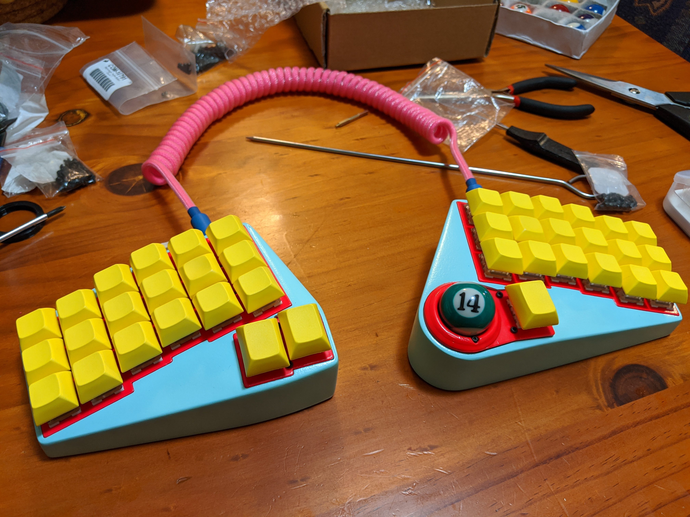

# Oddball

The Oddball is a split mechanical keyboard with an integrated trackball. While drawing inspiration from things like the [Jian](https://github.com/KGOH/Jian-Info) and the [Dactyl Manuform](https://github.com/abstracthat/dactyl-manuform), it is instead designed with a switch plate and PCB to give it durability, replicability, and a more utilitarian look. It has a relatively minilamal key layout, typically with 39 keys in total. The PCB is reversible so it can be built with 0, 1 or theoretically 2 trackballs. The trackball sensor is an ADNS900, using a board integration from [Jack Enterprises via Tindie](https://www.tindie.com/products/jkicklighter/adns-9800-laser-motion-sensor/). Due to the height and angle of the sensor, it requires a tented case.

See the build log at [https://atulloh.github.io/oddball/](https://atulloh.github.io/oddball/)

## Firmware

The Oddball is powered by [QMK Firmware](https://qmk.fm/). You can download and compile the firmware from the [QMK GitHub repository](https://github.com/qmk/qmk_firmware) or create a layout online with the [QMK Configurator](https://config.qmk.fm/#/oddball/LAYOUT). Note that for hands using a trackball, leave the inner 1.25u thumb key unassigned, as it will be replaced by the trackball.

# License

MIT License

Copyright (c) 2020 Alexander Tulloh